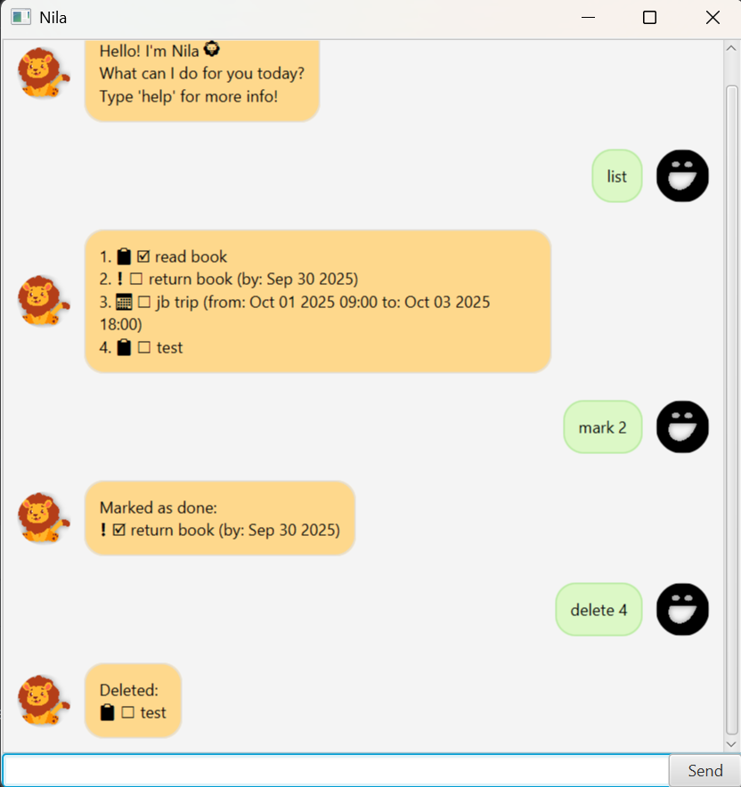

# Nila User Guide



## Product Intro
Nila is a friendly task management chatbot that helps you organize your todos, deadlines, and events.
With Nila, you can easily keep track of your tasks and never miss important deadlines!

## Adding Tasks

### 1) Adding a Todo

Adds a simple task without any date/time constraints.

Format: `todo DESCRIPTION`

Example: `todo read book`

```
expected output:

Added: 📋 ☐ read book
```

### 2) Adding a Deadline

Adds a task with a specific due date or datetime.

Format: `deadline DESCRIPTION /by yyyy-MM-dd` or `deadline DESCRIPTION /by yyyy-MM-dd HHmm`

Example: `deadline return book /by 2025-09-30` or  `deadline submit report /by 2025-10-15 1400`

```
expected output:

Added: ❗ ☐ return book (by: Sep 30 2025)
```

### 3) Adding an Event

Adds an event with specific start and end times.

Example: event team meeting /from 2025-10-01 1400 /to 2025-10-01 1500

Format: `event DESCRIPTION /from yyyy-MM-dd HHmm /to yyyy-MM-dd HHmm`

Example: `event team meeting /from 2025-10-01 1400 /to 2025-10-01 1500`

```
expected output:

Added: 📅 ☐ team meeting (from: Oct 01 2025 14:00 to: Oct 01 2025 15:00)
```

## Managing Tasks

### Listing All Tasks
Shows all tasks in your list with their current status.

Format: `list`

```
expected output:

1. 📋 ☐ read book
2. ❗ ☐ return book (by: Sep 30 2025)
3. 📅 ☐ team meeting (from: Oct 01 2025 14:00 to: Oct 01 2025 15:00)
```

### Marking Tasks as Done
Marks a task as completed using its index number.

Format: `mark INDEX`

Example: `mark 1`

```
expected output:

Marked as done:
📋 ✓ read book
```

### Unmarking Tasks
Marks a completed task as not done.

Format: `unmark INDEX`

Example: `unmark 1`

```
expected output:

Marked as not done:
📋 ☐ read book
```

### Deleting Tasks
Removes a task from your list.

Format: `delete INDEX`

Example: `delete 2`

```
expected output:

Deleted:
❗ ☐ return book (by: Sep 30 2025)
```

## Finding Tasks

### Searching Tasks

Finds tasks containing specific keywords in their descriptions.

Format: `find KEYWORD`

Example: `find book`

```
expected output:

Matching tasks:
1. 📋 ☐ read book
```

## Other Commands

### Getting Help
Displays the help manual with all available commands.

Format: `help`

Expected Output: (Shows comprehensive help manual)

### Exiting Nila
Closes the chatbot application.

Format: `bye`

Expected Output: (Application closes after showing goodbye message)